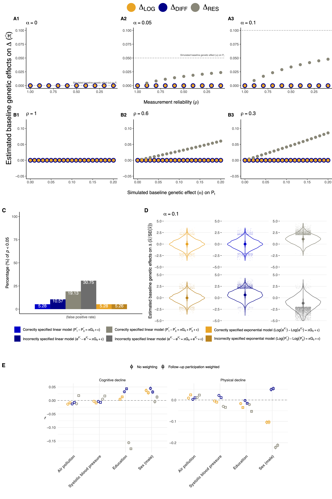

# Combining cross-sectional and longitudinal genomic approaches to dissect genetic and environmental contributions to cognitive and physical aging

## 1. Simulation work assessing two-wave models of change for longitudinal genetic effect estimation

Functions used to run the simulations:
- [simFunc.R](https://github.com/TabeaSchoeler/TS2023_UKBBlongitudinal/blob/main/analysis/simFunc.R)
Script to run the simulations
- [sim.R](https://github.com/TabeaSchoeler/TS2023_UKBBlongitudinal/blob/main/analysis/sim.R)

Resulting plot:



## 2. Preprocessing of phenotype data

### Extract and recode phenotype data

- [extractPheno.R](https://github.com/TabeaSchoeler/TS2023_UKBBlongitudinal/blob/main/analysis/extractPheno.R)

### Process phenotype data

- [processPheno.R](https://github.com/TabeaSchoeler/TS2023_UKBBlongitudinal/blob/main/analysis/processPheno.R)
- Curation of aging variables
- Script to prepare repeated measure data


### Get longitudinal phenotypes

- [longitudinal.R](https://github.com/TabeaSchoeler/TS2023_UKBBlongitudinal/blob/main/analysis/longitudinal.R)

## Sensitivity analyses assessing participation bias

- [bias.R](https://github.com/TabeaSchoeler/TS2023_UKBBlongitudinal/blob/main/analysis/bias.R)


## 3. Perform genome-wide scans using REGENIE

### GWA in REGENIE - Step 1:

```
$myprog \
--step 1 \
--bed $UKBB/plink/_001_ukb_cal_allchr_v2 \
--extract $UKBB/plink/qc_pass_for_regenie.snplist \
--phenoFile $HOME/data/gwas/$run \
--covarFile $HOME/data/gwas/${run}Covar \
--covarColList AGE,PC1,PC2,PC3,PC4,PC5,PC6,PC7,PC8,PC9,PC10 \
--catCovarList SEX,batch \
--maxCatLevels 3000 \
--bsize 1000 \
--lowmem \
--lowmem-prefix $HOME/data/gwas/ \
--out ${HOME}/output/gwas/${run}_s1 \
--threads $SLURM_CPUS_PER_TASK
```

#### GWA in REGENIE - Step 2:

```
$myprog \
--step 2 \
--bgen $UKBB/imp/_001_ukb_imp_chr"$a"_v2.REGENIE.bgen \
--ref-first \
--sample $UKBB/imp/ukb1638_imp_chr1_v2_s487398.sample \
--phenoFile $HOME/data/gwas/$run \
--covarFile $HOME/data/gwas/${run}Covar \
--covarColList AGE,PC1,PC2,PC3,PC4,PC5,PC6,PC7,PC8,PC9,PC10 \
--catCovarList SEX,batch \
--maxCatLevels 3000 \
--approx \
--pred $HOME/output/gwas/${run}_s1_pred.list \
--bsize 400 \
--split \
--out $HOME/output/gwas/chr"$a" 
```

- Process the results using [processGWA.R](https://github.com/TabeaSchoeler/TS2023_UKBBlongitudinal/blob/main/analysis/processGWA.R)


## 4. Mendelian Randomization

- Perform GWA and process the results using [mr.R](https://github.com/TabeaSchoeler/TS2023_UKBBlongitudinal/blob/main/analysis/mr.R)

## 5. Summary of the results

Script to summarize the results, generate manuscript plots and supplement tables
- [extractPheno.R](https://github.com/TabeaSchoeler/TS2023_UKBBlongitudinal/blob/main/analysis/extractPheno.R)


